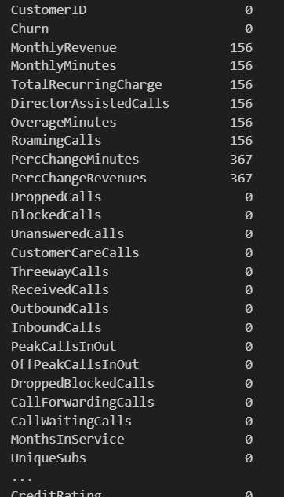
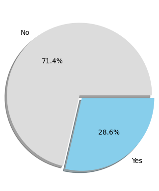
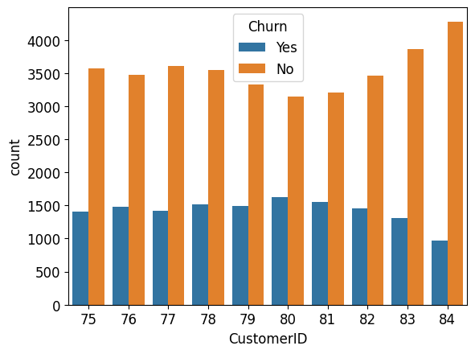
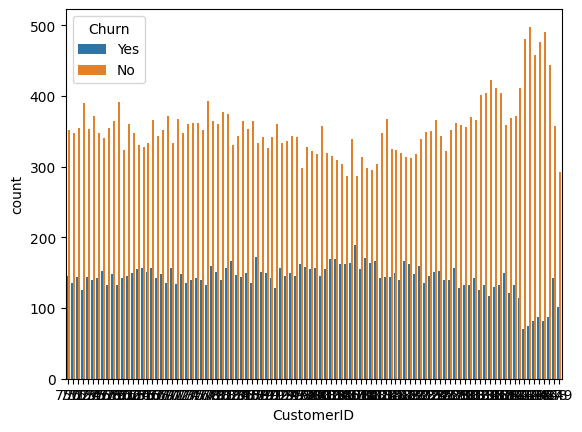
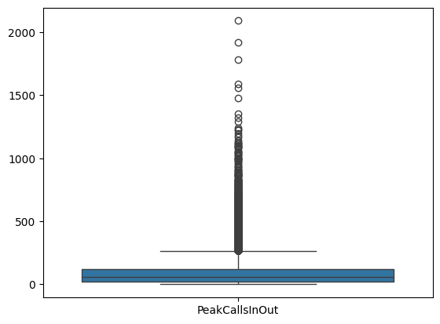
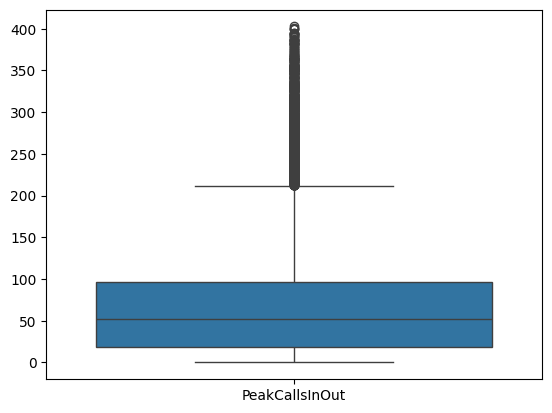
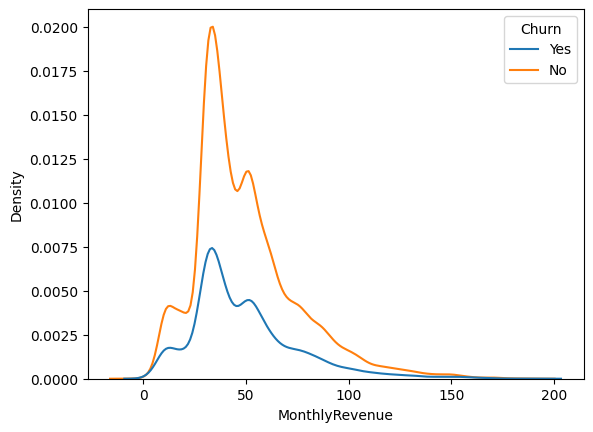
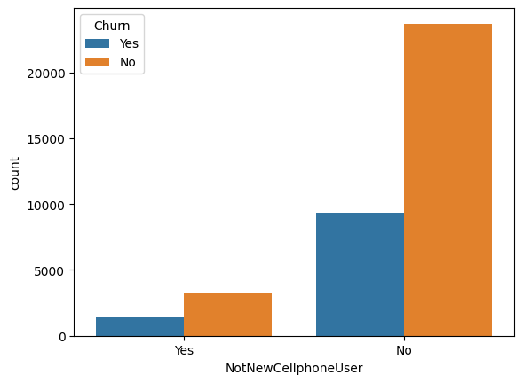
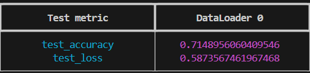
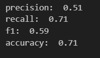

# SKN04-2nd-2Team
# SK네트웍스 4기 2번째 프로젝트 2조
<hr>
### 팀 소개

### 팀명 | 😎기도가 좋다🙏

### 팀원 소개
<p align="center">
        
        
        
        
        
  
<div align="center">
|   &nbsp;&nbsp; &nbsp; &nbsp; &nbsp;  &nbsp;  &nbsp;권오셈 &nbsp;&nbsp; &nbsp;&nbsp; &nbsp;  &nbsp;  &nbsp;    |      &nbsp;&nbsp; &nbsp;&nbsp; &nbsp;  &nbsp;  &nbsp;오창준  &nbsp;&nbsp; &nbsp;&nbsp; &nbsp;  &nbsp;  &nbsp;    |      &nbsp;&nbsp; &nbsp;&nbsp; &nbsp;  &nbsp;  &nbsp;박화랑  &nbsp;&nbsp; &nbsp;&nbsp; &nbsp;  &nbsp;  &nbsp;    |     &nbsp;&nbsp; &nbsp;&nbsp; &nbsp;  &nbsp;  &nbsp;김효은  &nbsp;&nbsp; &nbsp;&nbsp; &nbsp;  &nbsp;  &nbsp;   | 
        
|&&nbsp; &nbsp; &nbsp; &nbsp;  &nbsp;  팀장, DL &nbsp;&nbsp; &nbsp; &nbsp; &nbsp;  | &nbsp; &nbsp; &nbsp;  &nbsp;  &nbsp;DL, README &nbsp;&nbsp; &nbsp; &nbsp; &nbsp; |  &nbsp; &nbsp; &nbsp;  &nbsp;  &nbsp;EDA, ML(LGBM, XGB) &nbsp;&nbsp; &nbsp; &nbsp; &nbsp;  | &nbsp; &nbsp; &nbsp; &nbsp;  &nbsp;  EDA(Z-scale), ML(RF) &nbsp;&nbsp; &nbsp; &nbsp; &nbsp;|


</div>

### 데이터 분석 목표
>
<hr>
- 통신사의 고객별 사용량,요금,고객의 소득, 통화 패턴 등 여러 데이터를 이탈 여부와 ML,DL모델을 통해 결부시켜, 고객 데이터들 통해 향후 고객 이탈 예측 및 대응방안 강구


### 데이터 로드 및 결측치| 중복값 확인

```python
# 결측치 확인
data.isna().sum()
```


```python
# 결측치 최대 3515개
# 전부 drop해도 최소 약47000개 정도 남으니까 전부 drop
data.isna().sum().sum() 
data = data.dropna().reset_index(drop=True)
```
```python
data.duplicated().sum() # 중복값 확인| 결과는 0
```
```python
# 본격적으로 들어가기 target데이터 분포 확인
# 불균형함
plt.pie(
    data.Churn.value_counts(),
    explode = [0, 0.05], # 각 조각 사이 거리
    labels = data.Churn.value_counts().index,
    autopct='%1.1f%%', # 퍼센트 표시
    colors=['#dcdcdc', '#87ceeb'],
    shadow=True
)
```



### EDA 및 전처리

``` python
new_data_1 = data.filter(items=['Churn', 'CustomerID']) # CustomterID가 Index역할을 하고 있는데 혹시 범위별로 묶으면 유의미한 변수일까 확인
new_data_1.CustomerID = new_data_1.CustomerID//40000 # CustomerID 범주화 40000개씩 묶음
new_data_1

sns.countplot(
    new_data_1,
    x= 'CustomerID',
    hue= 'Churn'
)
# 범주를 묶어서 확인해 봤는데 유의미한 변화 X
```


```python
# 더 세부적으로 묶음
new_data_1 = data.filter(items=['Churn', 'CustomerID'])
new_data_1.CustomerID = new_data_1.CustomerID//4000 # 이번에는 CustomerID 4000개씩 묶음
sns.countplot(
    new_data_1,
    x= 'CustomerID',
    hue= 'Churn'
)
# 마찬가지로 의미없음 그래서 CustomerID drop
```


```python
# 숫자형 데이터 boxplot 찍어보기
# 사분위 수 범위에서 크게 벗어나는 애들 제거
sns.boxplot(
    data.loc[:, (data.dtypes != object)].iloc[:, [16]],
)
```


```python
# Z-score 활용해서 이상치 제거
columns_to_zscore = ['MonthlyRevenue', 'MonthlyMinutes', 'TotalRecurringCharge',
       'DirectorAssistedCalls', 'OverageMinutes', 'RoamingCalls',
       'PercChangeMinutes', 'PercChangeRevenues', 'DroppedCalls',
       'BlockedCalls', 'UnansweredCalls', 'CustomerCareCalls', 'ThreewayCalls',
       'ReceivedCalls', 'OutboundCalls', 'InboundCalls', 'PeakCallsInOut',
       'OffPeakCallsInOut', 'DroppedBlockedCalls', 'CallForwardingCalls',
       'CallWaitingCalls', 'MonthsInService', 'UniqueSubs', 'ActiveSubs',
       'Handsets', 'HandsetModels', 'CurrentEquipmentDays', 'AgeHH1', 'AgeHH2',
       'RetentionCalls', 'RetentionOffersAccepted',
       'ReferralsMadeBySubscriber', 'IncomeGroup',
       'AdjustmentsToCreditRating']
z_scores = stats.zscore(data[columns_to_zscore])
outliers_mask = (abs(z_scores) > 3).any(axis=1)
data = data[~outliers_mask]

# 만족스럽게 제거 됐는지 확인
sns.boxplot(
    data.loc[:, (data.dtypes != object)].iloc[:, [16]],
)
``` 


```python
# 이상치 제거 후 0으로 통일된 값들 확인 후 drop
data.loc[:, (data.sum() == 0)].value_counts()
data = data.drop(columns=['RetentionCalls', 'RetentionOffersAccepted', 'ReferralsMadeBySubscriber'])
```

### 수치형데이터 확률밀도함수 확인 (데이터 분포)
```python
sns.kdeplot(
    data,
    x= data.loc[:, (data.dtypes != object)].columns[0],
    hue='Churn'
)
```


```python
# 범주형데이터 데이터 분포 확인

sns.countplot(
    data,
    x=data.loc[:, (data.dtypes == object)].columns[15],
    hue='Churn'             
)
```


```python
# object형 숫자형으로 바꿔주기
label_encoders = {}
for column in data.loc[:, (data.dtypes == object)].columns:
    label_encoder = LabelEncoder()
    data.loc[:, column] = label_encoder.fit_transform(data[column])

    label_encoders.update({column: label_encoder})

data = data.astype(dict(zip(np.extract(data.dtypes == object , data.columns), ['float']*23)))

# csv 내보내기
data.to_csv('./data/preprocessing_train.csv', index= False)
```
### DEEP LEARNING
>
<hr>

전처리 후 이진 분류에 필요한 모델과 OPTIMIZER, 손실함수 선정
모델 - MLP : 고객행동/특성과 이탈여부 사이의 비선형적인 복잡한 관계를 학습하기 위해서.

옵티마이저 - ADAM : ADAM은 학습률을 자동으로 조정하기에 더 효율적으로 최적화 과정을 진행할 수 있음.
학습 특성이 많은 경우에도, ADAM은 다른 OPTIMIZER보다 빠르게 답에 수렴하면서도 과적합을 방지하는데 도움이 된다고 알려져 있음

손실함수 - binary_cross_entropy(BCE)_with_logits : 이진 분류 문제에 적합한 손실 함수. 내부적으로 Sigmoid와 교차 엔트로피 손실을 함께 계산하기 때문에 그냥 BCE보다 수치적으로 안정적이고 효율적임.


하이퍼파라미터 튜닝 요약
>
<hr>

다음 서술될 유의미한 변화를 관찰할 수 없다는 말은
정확도(Acc), VAL_LOSS, TRAIN_LOSS의 수치상 유의미한 변화를 찾을 수 없음을 의미.


BATCH SIZE

64 ~ 512 유의미한 차이 관찰 X

EPOCHS

PATIENT 5~10 설정시 LOSS 4~6STEP 후 early stop 에 의해 정지
LEARNING RATE

0.001 ~ 0.03 범위에서 유의미한 변화 관찰 X

HIDDEN_DIM

64~512 유의미한 결과 관찰 X
DROPOUT RATIO

0.1에서 0.5까지 유의미한 경향 X
은닉층 개수 2개 ~7개

유의미한 변화 관찰 X
NNI를 통한 최종 HYPERPARAM 조합
<div align="center">

</div>


HIDDEN LAYER 개수 4, EPOCHS 10, EARLY-STOP 작동X
<div align="center">
        
실행결과


cross_validation 결과

</div>


Deel Learning결과
test data의 0 대 1 비율은 약 71: 29 인데 acc가 0.71
결과를 보면 0의 재현율이 recall이 1
loss값은 줄어드는 모습을 보임
1,2,3 을 종합해 보았을 때, 학습이 만족스러운 수준으로 일어나지 않았고, 많은 값들이 1으로 올라가지 못하는 모습을 관찰할 수 있음.

### ML 사용기법: LGBMClassifier, XGBClassifier, RandomForestClassifier

선정이유: Tree계열 모델을 활용하여 Feature_importace 뽑아 어떤 변수가 고객이탈에 유의미한 영향을 끼치는 지 확인

```python

for i, (train_index, test_index) in enumerate(stratified_k_fold.split(data, data.Churn)):
    temp = data.iloc[train_index]
    test = data.iloc[test_index]
    train, valid = train_test_split(temp, test_size= len(test)/len(temp), random_state=0)

    rf = RandomForestClassifier(random_state=0)
    
    parameters = {
        'max_depth': np.random.randint(1, 15, 5),
        'n_estimators': np.random.randint(50, 500, 20),
        }

    random_search = RandomizedSearchCV(rf, parameters, random_state=0)
    random_search.fit(train.drop(columns=['Churn']), train.Churn)

    index_best_param = random_search.cv_results_.get('rank_test_score').argmax()
    best_params = random_search.cv_results_.get('params')[index_best_param]

    rf =RandomForestClassifier(
        n_estimators = best_params.get('n_estimators'),
        max_depth = best_params.get('max_depth'),
        random_state=0
    ).fit(train.drop(columns=['Churn']), train.Churn)

    confusion_matrix_result = confusion_matrix(
        test.Churn,
        rf.predict(test.drop(columns=['Churn']))
    )

```
# 모델 학습 결과
### LGBMClassifier
| Fold | precision | recall | f1 | accuracy |best_importances|
|------|-----------|--------|----|----------|----------------|
|fold1| 0.71 | 0.99 |0.83| 0.71| MonthsInService| 
|fold2| 0.74 | 0.91 |0.82| 0.71| PercChangeMinutes|
|fold3| 0.74 | 0.92 |0.82| 0.71| PercChangeMinutes|
|fold4| 0.71 | 1.0  |0.83| 0.71| MonthsInService| 
|fold5| 0.74 | 0.93 |0.82| 0.72| PercChangeMinutes|

### XGBClassifier
| Fold | precision | recall | f1 | accuracy |best_importances|
|------|-----------|--------|----|----------|----------------|
|fold1| 0.74 | 0.90 |0.81| 0.70| HandsetRefurbished| 
|fold2| 0.75 | 0.89 |0.81| 0.70| HandsetRefurbished|
|fold3| 0.74 | 0.89 |0.81| 0.70| HandsetRefurbished|
|fold4| 0.74 | 0.90 |0.81| 0.70| HandsetWebCapable | 
|fold5| 0.74 | 0.90 |0.81| 0.7`| HandsetRefurbished|

### RandomForestClassifier
| Fold | precision | recall | f1 | accuracy |best_importances|
|------|-----------|--------|----|----------|----------------|
|fold1| 0.72 | 1.0  |0.83| 0.72| MonthsInService| 
|fold2| 0.72 | 1.0  |0.83| 0.72| PercChangeMinutes|
|fold3| 0.72 | 1.0  |0.83| 0.72| PercChangeMinutes|
|fold4| 0.72 | 1.0  |0.84| 0.72| MonthsInService| 
|fold5| 0.72 | 1.0  |0.83| 0.72| PercChangeMinutes|


# 결론

### acc: 0.8을 넘지 못함
### 유의미한 변수를 찾지 못함
### 데이터 불균형으로 인한 모델 학습 실패
### 유의미한 칼럼이 빠졌거나 애초에 Churn을 잘못수집했을 가능성이 있음음
